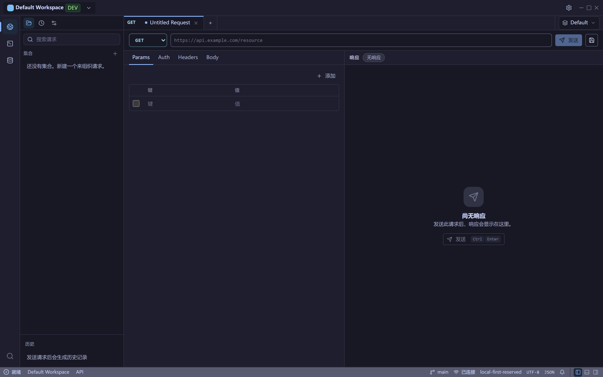
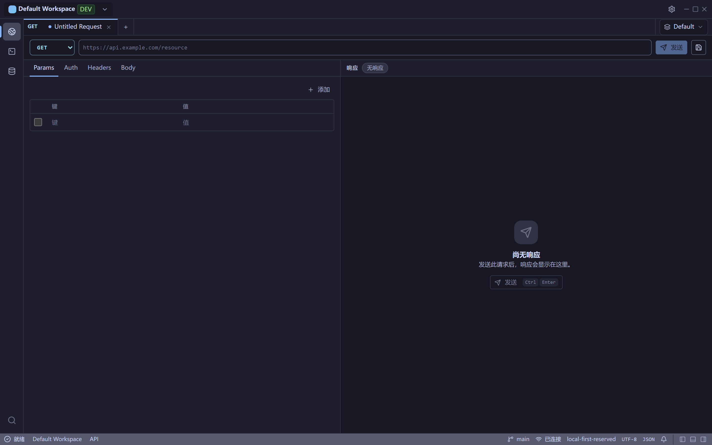
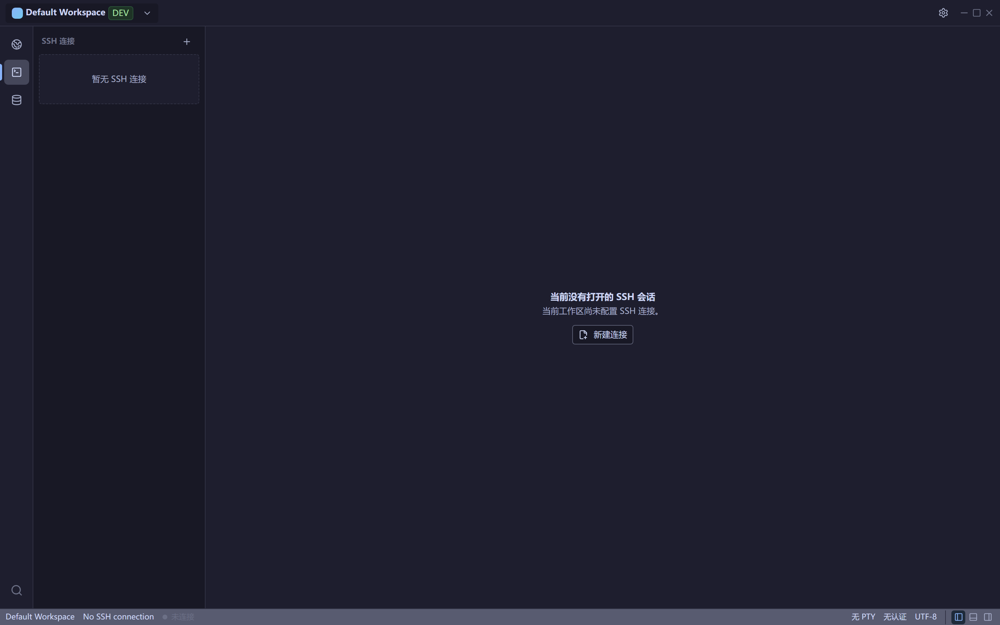
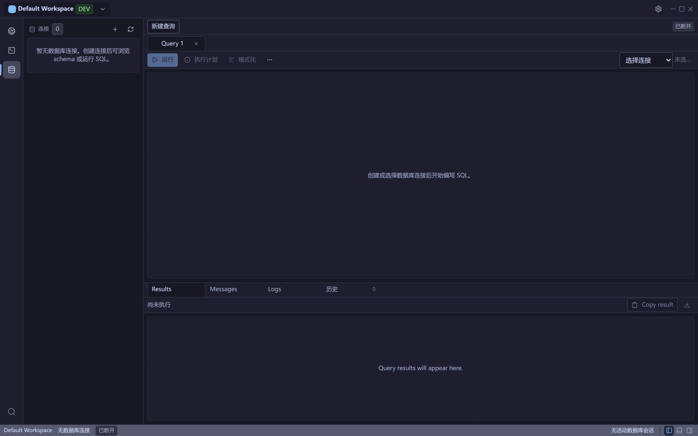

<div align="center">

[简体中文](README.zh-CN.md) · [English](README.md)

# Unfour

**一个面向后端开发者的本地优先桌面工作台，整合 API 调试、SSH 终端与数据库管理，并通过本地 MCP 服务把能力暴露给你的 AI Agent。**

[](LICENSE)
[](https://github.com/zyqzyq/Unfour/actions/workflows/ci.yml)
[](https://github.com/zyqzyq/Unfour/releases)
[](https://tauri.app)



</div>

> [!NOTE]
> Unfour `v0.1.0`。安装包尚未签名，可能触发 SmartScreen 或其他操作系统安全警告；请根据自己的要求验证此版本。

## 下载

请从 [GitHub Releases 下载 `v0.1.0`](https://github.com/zyqzyq/Unfour/releases/tag/v0.1.0)。

- Windows：普通用户推荐 NSIS `.exe`；偏好 MSI 或需要软件部署管理的用户可使用 MSI `.msi`。
  两种格式安装的是同一个 Unfour 版本，请二选一。
- 不建议在同一台设备上同时安装两种 Windows 格式，否则可能出现重复快捷方式、重复卸载项或升级路径混乱。
  当前不实现格式互相检测、自动卸载或交叉升级。
- macOS 与 Linux 安装包在完成真实设备冒烟检查前属于 experimental/unverified（实验性/未验证），不要将其视为已支持或已验证平台。
- 使用 Release 中的 `SHA256SUMS.txt` 校验下载的安装包。

## Unfour 是什么？

Unfour 是一个面向后端与运维工作的本地优先桌面工作台。它把 API 请求、SSH 连接、
数据库连接、本地活动与工作台布局统一在一个本地优先的应用中，并通过本地 MCP 服务把这些
能力暴露给你的 AI Agent。基于这一基础之上的 AI 辅助排障工作流仍在规划中。

应用基于 Tauri 2、React、TypeScript 与 Rust 构建。前端负责工作台界面，而 HTTP、SSH、
数据库驱动、本地存储与凭据引用等安全敏感的执行逻辑，则位于 Rust 能力模块与命令总线之后。

## 模块

- **API Client（API 客户端）** - 编写并发送 HTTP 请求，将已保存的请求整理为集合与
  文件夹，解析工作区环境变量，检查响应体 / 请求头 / Cookie / 耗时，并保留经过脱敏的
  历史记录。
- **SSH Terminal（SSH 终端）** - 管理 SSH 连接，启动终端会话，使用分屏与搜索，处理
  主机密钥信任，并导出经过脱敏的会话日志。
- **Database（数据库）** - 管理数据库连接，浏览 Schema，在带确认的安全检查下运行
  SQL，预览表数据，并查看查询结果。
- **Workspace（工作区）** - 将已保存的请求、环境变量、连接、活动、标签页与布局状态
  限定在某个本地工作区之内。
- **Local MCP server（本地 MCP 服务）** - 通过桌面应用所用的同一命令总线，把安全的
  本地诊断工具暴露给 MCP 客户端（如 Codex、Claude Code 或 Cursor），让你的 AI Agent
  能够使用同样的 API、SSH 与数据库上下文。

## 截图

**应用总览 — 左侧模块切换栏与 API Client 工作台**


**API Client — 含 Params / Auth / Headers / Body 的请求构造器与响应区**



**SSH 终端 — 连接与会话管理**



**数据库 — Schema 浏览与 SQL 查询输出**



## 本地开发

环境要求：

- Node.js 与 pnpm。
- 稳定的 Rust 工具链。
- 对应操作系统的 Tauri 2 前置依赖。

安装与运行：

```bash
pnpm install
pnpm run dev
```

常用命令：

```bash
pnpm run build          # 构建桌面前端
pnpm run check          # 前端构建 + Rust 检查 + 大文件检查
pnpm run lint           # ESLint
pnpm run test           # 前端单元测试（Vitest）
pnpm run test:e2e       # Playwright 冒烟测试
pnpm run check:rust     # cargo check --workspace
pnpm run check:rust:ssh # 启用 ssh-native 特性的 cargo check
pnpm run test:rust      # cargo test --workspace
pnpm run tauri build    # 生成 Tauri 发布包
```

除非某个包的文档另有说明，否则请从仓库根目录运行上述命令。

## 项目结构

| 路径 | 职责 |
| --- | --- |
| `apps/desktop` | Tauri/Vite 桌面应用入口与 Tauri 适配层。 |
| `packages/app-shell` | 全局外壳组合与模块挂载槽位。 |
| `packages/api-client` | API Client 前端模块。 |
| `packages/ssh-terminal` | SSH Terminal 前端模块。 |
| `packages/database` | Database 前端模块。 |
| `packages/workspace-core` | 共享前端工作区状态。 |
| `packages/workspace-local` | 预留的本地工作区生命周期边界。 |
| `packages/ui` | 共享 UI 基础组件与无状态布局辅助。 |
| `packages/command-client` | 类型化的 Tauri 命令封装与前端命令类型。 |
| `crates/*` | Rust 后端能力模块与适配器。 |

完整的包与模块（crate）映射请参阅 `docs/architecture/project-structure.md`。

## 发布状态

当前已发布 `v0.1.0`。发布就绪程度受以下验证证据限制：

- `docs/testing/release-verification.md`
- `docs/testing/manual-test-cases.md`
- `docs/release/release-checklist.md`
- `docs/release/distribution.md`
- `docs/release/signing.md`

Windows 当前同时提供 NSIS `.exe` 与 MSI `.msi`：普通用户推荐 NSIS，偏好 MSI 或需要软件部署管理的用户选择 MSI。
两种格式应二选一。安装包尚未签名，可能触发 SmartScreen。
macOS 与 Linux 在完成真实设备冒烟检查前仍是 experimental/unverified（实验性/未验证）。除非发布检查确实成功执行，
或有当前仓库证据支撑，否则不得声称其通过。

## 文档

- `AGENTS.md` - 面向编码 Agent 的仓库规则。
- `docs/agents/START_HERE.md` - 面向 AI Agent 的按需引导路径。
- `docs/architecture/package-boundaries.md` - 包归属与禁止的依赖方向。
- `docs/architecture/project-structure.md` - 仓库、包、模块（crate）与调用链映射。
- `docs/architecture/data-storage.md` - 工作区数据、SQLite、凭据引用与本地活动规则。
- `docs/architecture/diagnostics.md` - 本地结构化日志、脱敏、留存、诊断包与开发日志指引。
- `docs/architecture/security-model.md` - 安全姿态、脱敏、主机密钥策略与危险操作规则。
- `docs/mcp/overview.md` 与 `docs/mcp/tools.md` - 本地 MCP 服务行为。
- `docs/testing/release-verification.md` - 发布验证矩阵。
- `docs/release/release-checklist.md` - 公开发布检查清单。
- `docs/user/USER_GUIDE.md` - 面向用户的工作流指南。

## 参与贡献

在提交 Pull Request 前，请先阅读 `CONTRIBUTING.md`、`CODE_OF_CONDUCT.md` 以及
`AGENTS.md` 中的包边界规则。

安全问题请通过 `SECURITY.md` 反馈，不要使用公开 Issue。

## 许可证

基于 [Apache License 2.0](LICENSE) 开源。
